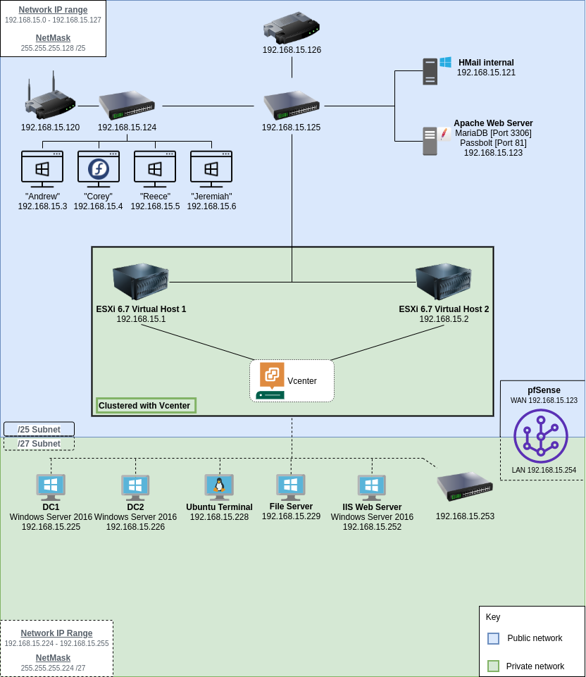

img# Network-Plan-Group2
Repo setup for deocumentation and record of plans and implementation

# Network IP Schema

> Shows the general IP schema of the network.

| IP Address | Device | Network    | Description |
| ----------| ------- | ---------- | ----------- |
| 2.2.2.254 | Network | 2.2.2.0/24 | Main Router |
| 2.2.2.49  | Switch  | 2.2.2.0/24 | Main Switch |
| 2.2.2.1   | ESXi 6.0| 2.2.2.0/24 | |
| 2.2.2.2   | ESXi 7.0| 2.2.2.0/24 | |
| 2.2.2.48ESXi  | Ubuntu-Server  | 2.2.2.0/24 | Apache Web Server |
| 2.2.2.11  | Domain Controller 1    | 2.2.2.0/24 | Windows Server 2016|
| 2.2.2.12  | Domain Contorller 2    | 2.2.2.0/24 | Windows Server 2016|
| 2.2.2.5   | Windows 10 Terminal    | 2.2.2.0/24 | Andrew |
| 2.2.2.6   | Linux Fedora Terminal    | 2.2.2.0/24 | Corey |
| 2.2.2.7   | Windows 10 Terminal   | 2.2.2.0/24 | Reece |
| 2.2.2.8   | Windows 10 Terminal    | 2.2.2.0/24 | Jeremiah |

# Hardware Specifications

| Device   | Specifications   | Quantity |
| ---------| ---------------- | -------- |
| Dell R710 | Ram: |
| Dell R720   | Ram:    | 
| iMac | asdasd    |
| iMac | asdasd |

</img>